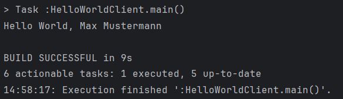
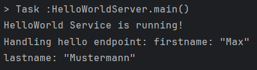

# GRPC Dokumentation

gRPC ist ein Framework von Google. RPC ist ein Function Call der Code auf einem anderen Gerät aufruft und wiederum ausführt. Man muss protobuf (Protocol Buffers) benutzen. Die definieren die Kommunikation zwischen Server und Client. Diese ist nicht abhängig von der Programmiersprache. Es ist eine Datei mit ".proto" Endung. Außerdem ist proto effizienter als JSON.

gRPC nützt HTTP/2 das ermöglicht Multiplexing, Stream prioritization, Binary protocol und Server push. Mehrere TCP-Pakete durch einen Stream. Braucht nur wenige Connections. 
    
    //definiert die Version
    syntax = "proto3";

    service HelloWorldService {
        //definiert das bei einem HelloRequest soll eine HelloResponse zurückgegeben werden.
        rpc hello(HelloRequest) returns (HelloResponse) {} 
    }
    
    //Die HelloRequest hat zwei Parameter mit dem Typ String und die Zahl definiert die reinfolge
    message HelloRequest {
        string firstname = 1;
        string lastname = 2;
    
    }
    
    //Die HelloResponse gibt nur einen String zurück
    message HelloResponse {
        string text = 1;
    }

## Fragen

### What is gRPC and why does it work across languages and platforms?
Am Anfang schon beantwortet

### Describe the RPC life cycle starting with the RPC client?

1. Client erstellt eine Request (stub)

2. Wird übersendet.

3. Kommt am Server an

4. Methode wird auf dem Server ausgeführt

5. Und eine Response wird geschickt
    
6. Describe the workflow of Protocol Buffers?

7. Erstellt nach vorlage des Proto-Files ein Request oder Response
    
### What are the benefits of using protocol buffers?

Es muss der Server und Client nicht in derselben Sprache sein.

### When is the use of protocol not recommended?

Bei großen Datenmengen oder bei häufigen Änderungen der Datenstruktur.

### List 3 different data types that can be used with protocol buffers?

Primitive Typen: int32, float, bool und string.
Enumerationen: Aufzählung von Werten, in Protobuf
Nachrichtentypen: Komplexe Datenstrukturen, aus Protobuf-Nachrichten bestehen.

## Was war neu? Was hab ich gemacht?

### Code

Ich habe die HelloWorld Dateien aus dem Kurs eingefügt, verstanden und dokumentiert.

    Hello.HelloResponse helloResponse = stub.hello(Hello.HelloRequest.newBuilder() //erstellt einen helloRequest
            .setFirstname("Max")
            .setLastname("Mustermann")
            .build());

Hier sieht man wie ein Request erstellt wurde mit den Parametern

    public void start() throws IOException {
        server = ServerBuilder.forPort(PORT)
                .addService(new HelloWorldServiceImpl())
                .build()
                .start();
    }

Dieser Code initialisiert einen server und fügt dem Server einen Service hinzu

    // Erstellt einen Text aus den Daten von dem Request
    String text = "Hello World, " + request.getFirstname() + " " + request.getLastname();
    //Erstellt eine Response aus dem Text
    Hello.HelloResponse response = Hello.HelloResponse.newBuilder().setText(text).build();

    //schickt den Request
    responseObserver.onNext(response);
    responseObserver.onCompleted();

Das ist die einzige Methode in HelloWorldServiceImpl und verarbeitet eine Anfrage in der übertragene Daten für einen String verwendet werden und dann mit "responseObserver.onNext(response)" zurück zum Client geschickt wird.

### gradle.build

    id 'com.google.protobuf' version '0.9.4'

weist die Nutzung von protobuf auf mit der Version 0.9.4. Das teilt Java mit das "Protobuf" interpretiert wird.

    implementation 'io.grpc:grpc-netty:1.68.1'
    implementation 'io.grpc:grpc-protobuf:1.68.1'
    implementation 'io.grpc:grpc-stub:1.68.1'
    implementation 'io.grpc:grpc-api:1.68.1'
    compileOnly 'javax.annotation:javax.annotation-api:1.3.2'

Das sind die nötigen Einbindungen für gRPC

    protobuf {
        protoc {
            artifact = "com.google.protobuf:protoc:3.25.5"
        }
        plugins {
            grpc {
                artifact = 'io.grpc:protoc-gen-grpc-java:1.68.1'
            }
        }
        generateProtoTasks {
            all().each { task ->
                task.plugins {
                    grpc {}
                }
            }
        }
    }

Bei protoc wird die Version definiert. plugins definiert gRPC für die interpretation von ".proto"-Dateien. generateProtoTasks konfiguriert die Protoc-Generierung, um gRPC-Code zu generieren.

    sourceSets {
        main {
            java {
                srcDir 'build/generated/source/proto/main/java'
                srcDir 'build/generated/source/proto/main/grpc'
            }
        }
    }

Definiert, wo der Java-Code gespeichert wird, nachdem er aus der ".proto"-Datei generiert wurde

## Output

Die Response die der Client vom Server bekommt

Die Request vom Client an den Server und start Zeichen