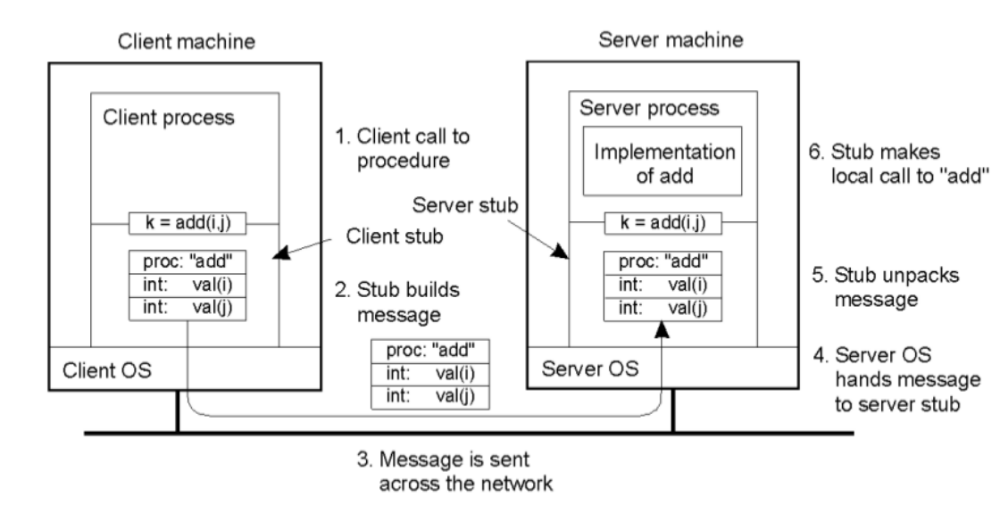

# GRPC Dokumentation

gRPC ist ein Framework von Google. RPC ist ein Function Call der Code auf einem anderen Gerät aufruft und wiederum ausführt. Man muss protobuf (Protocol Buffers) benutzen. Die definieren die Kommunikation zwischen Server und Client. Diese ist nicht abhängig von der Programmiersprache. Es ist eine Datei mit ".proto" Endung. Außerdem ist proto effizienter als JSON.

gRPC nützt HTTP/2 das ermöglicht Mutliplexing, Stream prioritization, Binary protocol und Server push. Mehrere TCP-Pakete durch einen Stream. Braucht nur wenige Connections. 
    
    //definiert die Version
    syntax = "proto3";

    service HelloWorldService {
        //definiert das bei einem HelloRequest soll eine HelloResponse zurückgegeben werden.
        rpc hello(HelloRequest) returns (HelloResponse) {} 
    }
    
    //Die HelloRequest hat zwei Parameter mit dem Typ String und die Zahl definiert die reinfolge
    message HelloRequest {
        string firstname = 1;
        string lastname = 2;
    
    }
    
    //Die HelloResponse gibt nur einen String zurück
    message HelloResponse {
        string text = 1;
    }

## Fragen

What is gRPC and why does it work accross languages and platforms?
    Am Anfang schon beantwortet
Describe the RPC life cycle starting with the RPC client?

Client erstellt eine Request (stub)

Wird übersendet

Kommt am Server an

Methode wird auf dem Server ausgeführt

Und eine Response wird geschickt
    
Describe the workflow of Protocol Buffers?

Erstellt nach vorlage des Proto-Files ein Request oder Response
    
What are the benefits of using protocol buffers?

Es muss der Server und Client nicht in derselben Sprache sein.

When is the use of protocol not recommended?

Bei großen Datenmengen oder bei häufigen Änderungen der Datenstruktur.

List 3 different data types that can be used with protocol buffers?

Primitive Typen: int32, float, bool und string.
Enumerationen: Aufzählung von Werten, in Protobuf
Nachrichtentypen: Komplexe Datenstrukturen, aus Protobuf-Nachrichten bestehen.